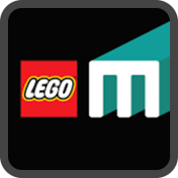
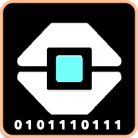

This is a quick tutorial for using [Pybricks](https://pybricks.com){:target="\_blank"} Python in LEGO robotics Competitions such as [FIRST LEGO League](https://www.firstlegoleague.org){:target="\_blank"} and [World Robot Olympiad](https://wro-association.org){:target="\_blank"}.

# About the author

[{: .profile .rounded }](https://attilafarago.hu)
My name is Attila Farago, I have been working in the software development industry for 20+ years and have engaged with LEGO robotics for the past 10 years both in the coach and the judge roles in FIRST LEGO League and World Robot Olympiad as well.

I am enthusiastic about helping individuals and teams to grow to their best and also learn from many experts all over the world. For me, learning, networking, and helping develop others are worth much more than winning.

You can check out my other hobby projects on my [personal page](https://attilafarago.hu){:target="\_blank"} and my [professional background](https://www.linkedin.com/in/afarago){:target="\_blank"}.

# About this tutorial

In the next sections, you will get a hands-on tutorial to help you get started with Pybricks which in my experience is the best and most effective way to program your LEGO hub.

This tutorial focuses on specific competition aspects, while the authors of Pybricks are creating a tutorial on the site itself. I strongly recommend reading [the official tutorial](https://pybricks.com/learn) as well.

# Let's start

Let us begin the learning and create a joyful experience with consistent robot runs where you can focus on strategy!

# Pssst: multivitamin at your hands - BlocklyPy

Before you leave, just remember this website that I created to read and translate most of the known LEGO EV and newer robotics software platforms.  
Just open the file, review the pseudocode, the block graphics preview and an automatic Pybricks Python translation.

[BlocklyPy web page](http://blpy.attilafarago.hu).

{: .devtype }
{: .devtype }
{: .devtype }
{: .devtype }
{: .devtype }
{: .devtype }

SPIKE Prime ([45678](https://www.lego.com/en-us/product/lego-education-spike-prime-set-45678)) and SPIKE Essentials ([45345](https://www.lego.com/en-us/product/lego-education-spike-essential-set-45345)) kit and Robot Inventor ([51515](https://www.lego.com/en-us/product/robot-inventor-51515)) kit for **word-blocks** and **icon-blocks** transformation.

-   SPIKE v2 (.llsp) files.
-   SPIKE v3 (.llsp3) files.
-   Robot Inventor files (.lms).

EV3 Mindstorms kit ([31313](https://www.lego.com/en-us/product/lego-mindstorms-ev3-31313)) LabView EV3-G code transformation.

-   EV3Classroom files (.lmsp).
-   EV3 Lab (.ev3) files.
-   EV3 Lab Compiled Binary (.rbf) files.

If you are a developer you can also build your own app leveraging the read and translate capabilities of
[BlocklyPy npm package library](https://www.npmjs.com/package/blocklypy).

---

[Tutorial >>](tutorial/0_intro.md)
