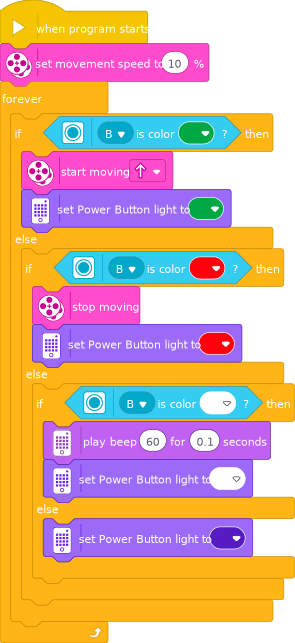
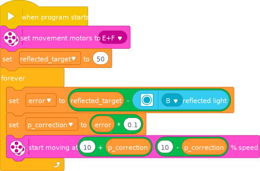

# Detecting and reacting to colors

Let's create a program that moves the robot until it detects red color.

{: .task }
> 1. Find the ColorSensor in the [documentation](https://docs.pybricks.com/en/latest/pupdevices/colorsensor.html){:target="_blank"}
> 1. Connect a color sensor to Port.B
> 2. Start the robot and move until the robot detects red color
> 3. Stop the robot

{: .task_solution }
> ```python
> motor_left = Motor(Port.E, Direction.COUNTERCLOCKWISE)
> motor_right = Motor(Port.F, Direction.CLOCKWISE)
> robot = DriveBase(motor_left, motor_right, 56, 114)
> color_sensor = ColorSensor(Port.B)
>
> robot.drive(100, 0)
> while color_sensor.color() != Color.RED:
>     wait(10)
> robot.stop()
> ```

Let's create a program that reacts on red, green and white color blocks.

{:width="100%" .program_code}

{: .task }
> 1. Check if the robot detected red, green or white cube
> 2. Set the hub light to the color if detected, otherwise turn the light off
> 3. On green: start the robot
> 4. On red: stop the robot
> 5. On white: beep shortly

{: .task_solution }
> ```python
> motor_left = Motor(Port.E, Direction.COUNTERCLOCKWISE)
> motor_right = Motor(Port.F, Direction.CLOCKWISE)
> robot = DriveBase(motor_left, motor_right, 56, 114)
> color_sensor = ColorSensor(Port.B)
>
> robot.drive(100, 0)
> while True:
>     color = color_sensor.color()
>     if color == Color.GREEN:
>         hub.light.on(Color.GREEN)
>         robot.drive(100, 0)
>     elif color == Color.RED:
>         hub.light.on(Color.RED)
>         robot.stop()
>     elif color == Color.WHITE:
>         hub.light.on(Color.WHITE)
>         hub.speaker.beep()
>     else:
>         hub.light.off()
> ```
>
> ```python
> # Alternative solution
> motor_left = Motor(Port.E, Direction.COUNTERCLOCKWISE)
> motor_right = Motor(Port.F, Direction.CLOCKWISE)
> robot = DriveBase(motor_left, motor_right, 56, 114)
> color_sensor = ColorSensor(Port.B)
>
> robot.drive(100, 0)
> while True:
>     color = color_sensor.color()
>     if color in [Color.GREEN, Color.RED, Color.WHITE]:
>         hub.light.on(color)
>         print(color)
>     else:
>         hub.light.off()
>     if color == Color.GREEN:
>         robot.drive(100, 0)
>     elif color == Color.RED:
>         robot.stop()
>     elif color == Color.WHITE:
>         hub.speaker.beep()
> ```

{:width="50%" .program_code}

# Following a black line

Following a black line surrounded by a white area is done by trying to move exactly on the edge between the black and white color.

We can measure the reflected light intensity, where white is 100 and black is a lower value, that is typically never 0, rather 20-30.
A simple P line following measures the difference or error from the area that is in between the white and black (`reflected_target`) i.e. `(100-30)/2 = 35` and steer the left and right motors based on the amount of error multiplied by a P coefficient.

{: .task }
> 1. Start the robot running forward
> 2. Measure the reflected light intensity
> 3. Check the difference from your target gray color
> 4. Turn left or right depending on the measured value is too bright or too dark.
> 5. Repeat indefinitely

{: .task_solution }
> ```python
> motor_left = Motor(Port.E, Direction.COUNTERCLOCKWISE)
> motor_right = Motor(Port.F, Direction.CLOCKWISE)
> robot = DriveBase(motor_left, motor_right, 56, 114)
> color_sensor = ColorSensor(Port.B)
>
> target_reflection = (100-30)/2
> while True:
>     error = target_reflection - color_sensor.reflection()
>     p_correction = error * 0.1
>     robot.drive(100, p_correction)
>     # alternatively
>     # motor_left_.run(100 + p_correction)
>     # motor_right.run(100 - p_correction)
> ```

{:width="75%" .program_code}

---
[NEXT: Summary >>](9_summary.md)