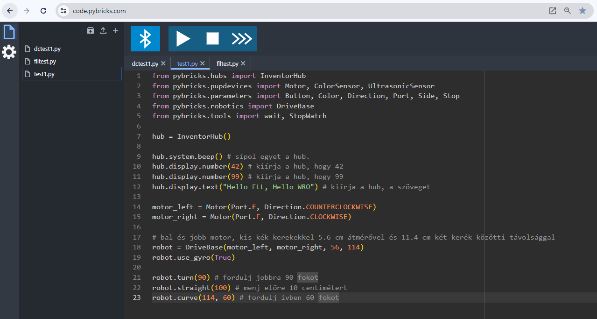
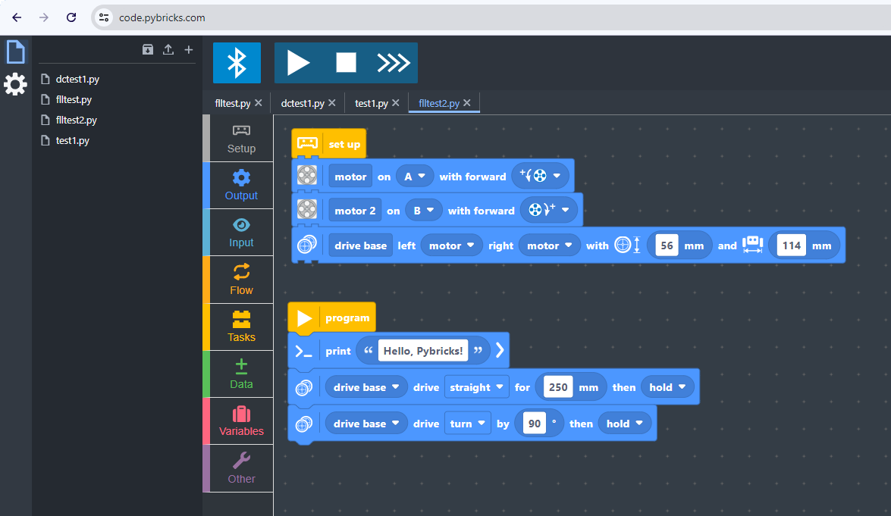

This environment simplifies programming by orders of magnitude compared to the traditional blocky-based system. Additionally the way Pybricks uses the DriveBase object makes your robot more reliable.

{: .highlight }
We are grateful to the developers of PyBricks and recommend that you try this framework out in the next season.

Pybricks has made these capabilities also available in a block-based environment that is not completely free, but requires a recurring or one-time payment. I have purchased the license because we have gained so much from this framework simply wanted to experiment and pay back, and I recommend that if you can, you also support the further development of Pybricks.

---
END OF THIS TUTORIAL.
